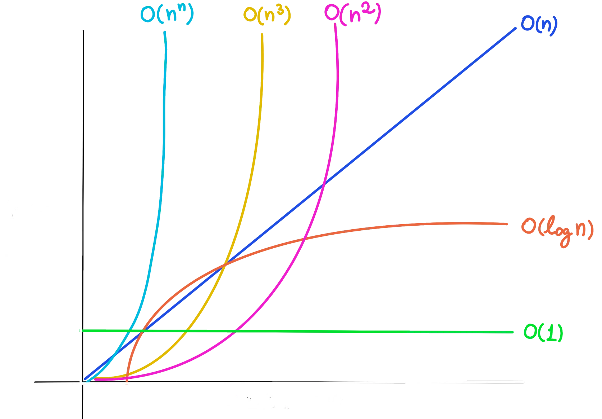

$$
O(1) \\ \scriptsize \color{gray}Constant
$$

$$
O(log\space n) \\ \scriptsize \color{gray} Logaritimic
$$

$$
O(n) \\ \scriptsize \color{gray} Linear
$$

$$
O(n * log\space n)  \\ \scriptsize \color{gray} Linearithimic
$$

$$
O(n^2), O(n^3), O(n^4)  \\ \scriptsize \color{gray} Quadratic,  Cubic, Polynomial 
$$

$$
O(2^n) \\ \scriptsize \color{gray} Exponential
$$

$$
O(n!) \\ \scriptsize \color{gray} Factorial
$$

> 🔥 _Big O Notation_ always refer to the **worst** **case** scenario

## Few Examples

O(25) → O(1)

O(2n) → O(n)

O(n² + 2n) → O(n²)

O(n³ + log(n) + 3) → O(n³)

O(n + m) → O(n + m)

O(2n + m) → O(n + m)

The most common Big O Notations are:

O(1) → Constant | Accessing a memory address

O(log n) → Logarithmic | Binary Search

O(n) → Linear | Iterating an Array 

O(n log n) → Linearithimic | Iterating an Array 

O(n²) → Quadratic | Nested Iterations

O(2^n) → Exponential | Nested Iterations

O(n!) → Factorial | Generate all permutations of a list

## Time Complexity

A measure of how fast an algorithm runs, time complexity is a central concept in the field of algorithms. It's expressed by using Big O notation.

## Space Complexity

A measure of how much auxiliary memory an algorithm takes up, space complexity is a central concept in the field of algorithms and it's also expressed using Big O notation

Flash Cards

