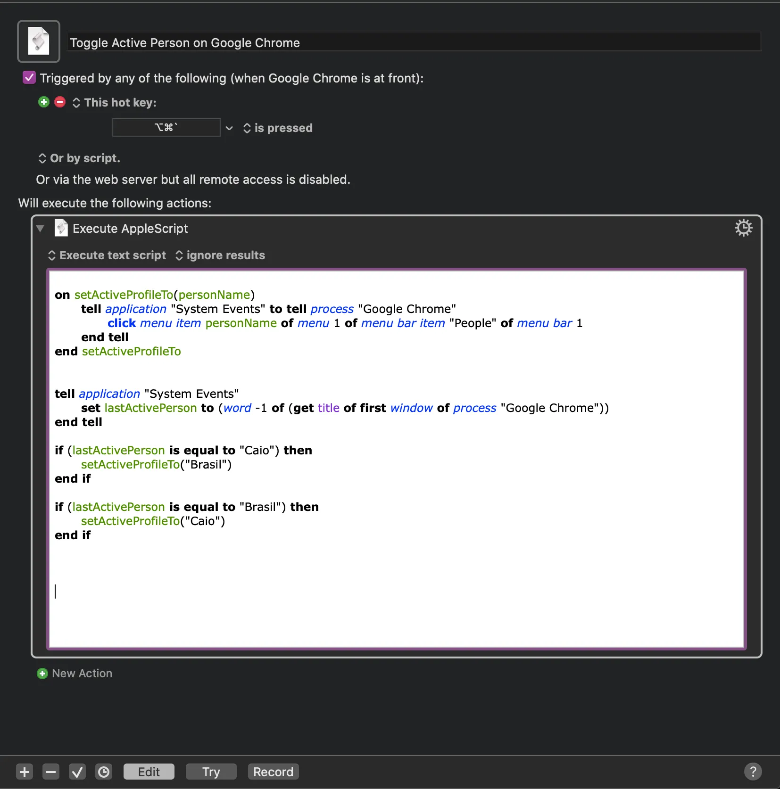

---
id: "db897d7a-08f4-4b6a-97f9-eeb0f1e95468"
date: "2020-10-28T23:31:00.000Z"
title: "Change Google Chrome Active Account Using Apple Script"
summary: undefined
readTime: undefined
tagIds: ["ffcd889d-91ab-49a0-9ff6-e7192fced192"]
tags: [{"id":"ffcd889d-91ab-49a0-9ff6-e7192fced192","name":"Blog","icon":"🌐"}]
--- 
 
```javascript
tell application "System Events" to tell process "Google Chrome"	
	click menu item "Caio" of menu 1 of menu bar item "People" of menu bar 1
end tell
```


# Changing Active User on Google Chrome


Lately I've been using the _People_ feature of Google Chrome a lot. It's currently helping me to isolate accounts scopes.


There's only one problem though, every time I want to switch the active person or perhaps just initiate a new session using a specific account I have to use the mouse ☹️ 


If you know me, you might be aware that I love using keyboard shortcuts, and that I avoid pointers at almost all costs, this changing active account feature on google chrome was killing my productivity on the day-to-day. So I've decided to create a Macro using Keyboard Maestro to Fix this


## The Macro


Well if you're familiar with using multiple windows from the same application on macOS, you might be aware that typing   `⌘``  will change switch through active application windows. So what I did was creating a macro to run when I press `⌘⌥`` 


It looks like this





This macro is on my Google Chrome macro group which means it will only run when the browser is active


And that's it! Here's the Apple Script code in case you need it 


```javascript
on setActiveProfileTo(personName)
	tell application "System Events" to tell process "Google Chrome"
		click menu item personName of menu 1 of menu bar item "People" of menu bar 1
	end tell
end setActiveProfileTo


tell application "System Events"
	set lastActivePerson to (word -1 of (get title of first window of process "Google Chrome"))
end tell

if (lastActivePerson is equal to "Caio") then
	setActiveProfileTo("Brasil")
end if

if (lastActivePerson is equal to "Brasil") then
	setActiveProfileTo("Caio")
end if
```

