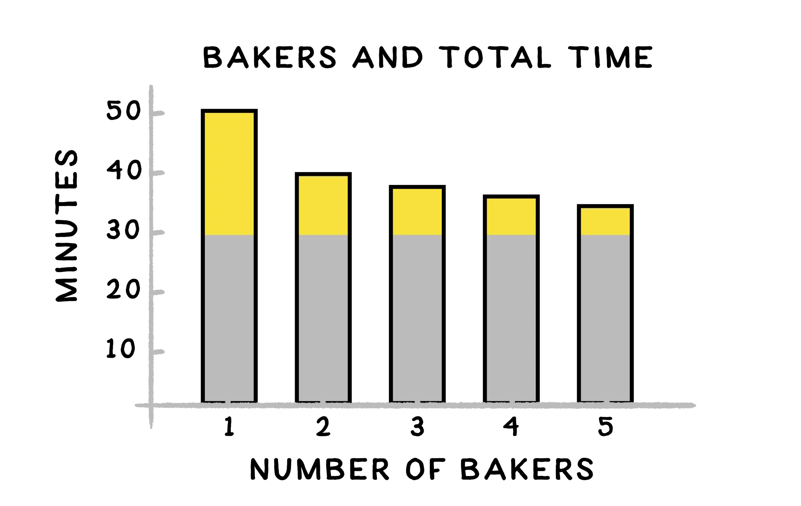
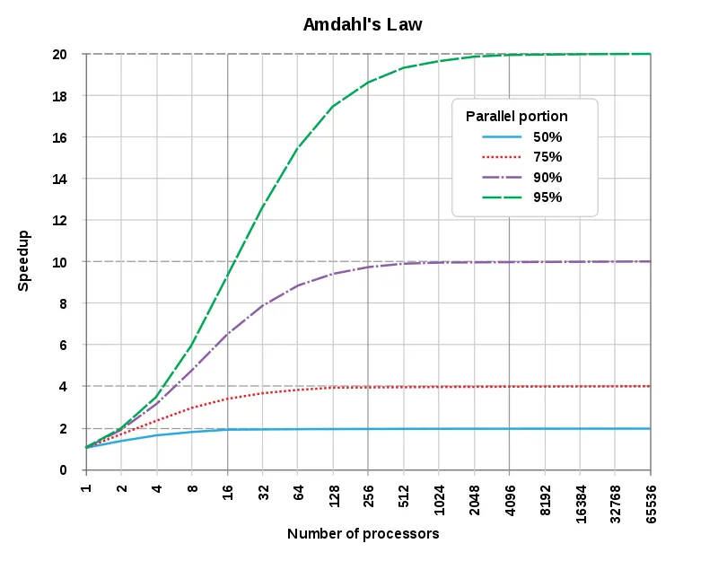
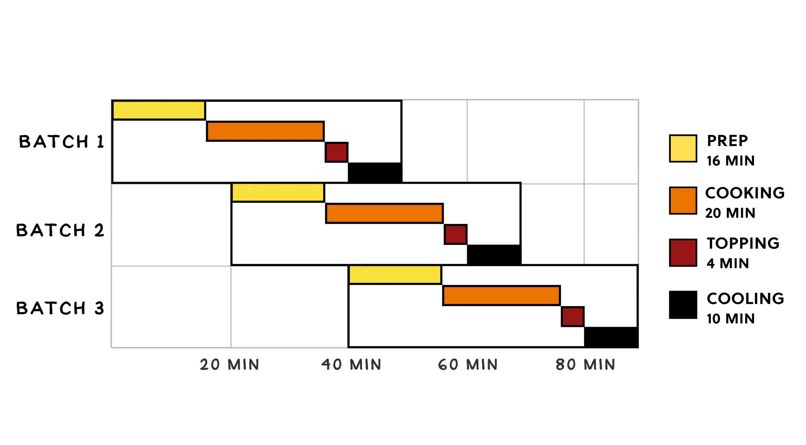

---
id: "2b3891a0-a1cd-4549-8089-db53bda1709c"
date: "2020-04-25T16:59:00.000Z"
title: "Computer Science Series: Parallelism"
summary: "Learn about parallelism in computer science, including Amdahl's Law, pipelining, and concurrency. Discover how to optimize tasks for speed and efficiency."
readTime: undefined
tagIds: ["cf9e8fbb-d012-457e-9292-fa90e7e8b5a2","ed316d45-b88a-48a5-920a-5a2a154bcbe5","56275194-6e13-4cd3-ae9a-4a285a880bcb","a82004cd-5435-4ab5-af04-c0898ae2044c","ffcd889d-91ab-49a0-9ff6-e7192fced192"]
tags: [{"id":"cf9e8fbb-d012-457e-9292-fa90e7e8b5a2","name":"Brilliant","icon":""},{"id":"ed316d45-b88a-48a5-920a-5a2a154bcbe5","name":"Study","icon":"🧠"},{"id":"56275194-6e13-4cd3-ae9a-4a285a880bcb","name":"Computer Science","icon":""},{"id":"a82004cd-5435-4ab5-af04-c0898ae2044c","name":"Software Engineering","icon":"⚙"},{"id":"ffcd889d-91ab-49a0-9ff6-e7192fced192","name":"Blog","icon":"🌐"}]
--- 
 
By the end of this topic you will learn

- [x] _Amdahl's law, an important piece of common-sense mathematics for computer scientists_
- [x] _pipelining, a form of parallelism that enables advanced computer graphics_
- [x] _concurrency and how it's managed to let the many apps on your phone run at the same time_

Flash Cards


When multiple workers can split up a problem without adding much extra coordination overhead, computer scientists sometimes call the problem _**embarrassingly parallel.**_

<details>
<summary>Code to solve the problem</summary>

```javascript
const timeToCutTheDoghIntoTriangles = 2
const timeToSpreadFillingOntoTriangles = 4
const timeToRollFilledTrianglesIntoCrescents = 10
const timeToPlacePastriesIntoTheOven = 20
const timeToRemovePastriesFromTheOven = 4
const timeToLeftThePastriesCool = 10

const sum = (...args) => args.reduce((sum, item) => sum + item, 0)

const workers = 2

const parallelWork = sum(
    timeToCutTheDoghIntoTriangles,
    timeToSpreadFillingOntoTriangles,
    timeToRollFilledTrianglesIntoCrescents,
    timeToRemovePastriesFromTheOven,
) //?

const notParallelWork = sum(
    timeToLeftThePastriesCool,
    timeToPlacePastriesIntoTheOven
) //?

const pierreTotalTime = sum(
    timeToCutTheDoghIntoTriangles / workers,
    timeToSpreadFillingOntoTriangles / workers,
    timeToRollFilledTrianglesIntoCrescents / workers,
    timeToPlacePastriesIntoTheOven,
    timeToRemovePastriesFromTheOven / workers,
    timeToLeftThePastriesCool,
) //? 

const bakeryTime = sum(
    parallelWork / 16,
    notParallelWork
) //?

const desiredTime = 35
 parallelWork
 workers
 notParallelWork

const workersNeededFor5MinutesGain = (
    parallelWork / - (notParallelWork - (40 - 5))
) //?


70 - 90 //?

const pierreAverageProductionPerMinute = (
    200 / 20
) //?


const averagePasteriesForMinute = (
    200 / 30
) //?
```


</details>


[_**Gene Amdahl**_](https://en.wikipedia.org/wiki/Gene_Amdahl)


## Not all tasks can be done in Parallel


When you think about parallel and non-parallel tasks it should be obvious that adding more workers will only make you faster at the parts of a task that can be done in parallel. [_**Amdahl's law**_ ](https://en.wikipedia.org/wiki/Amdahl%27s_law)says that we cannot make a task faster just by putting more agents into the task. This conclusion came after a paper from _**Gene Amdahl**_  in 1967








## Pipelining


Pipelining is a very common form of parallelism when you think about making cookies or bread. When you want to make a huge amount of food you often will nee to create a pipeline for making this tasks parallel for. For example, let's say you're baking 2 cakes, and your oven can only fit one. In order to optimize your cake-per-minute ratio you can prepare another cake while your other cake is in the oven. 


This form of parallelism is called _Pipelining._ By working on different branches of your work in parallel.





Pipeline is also used in computer generated graphics to predict which chunks it will need to render next. This concept is called _speculative execution._


## Concurency


**Concurency** is the name for situations where multiple agents each want a turn at having exclusive access to the same resource. It sometimes show up in similar places as parallelism, but concurrency occurs when there's no way to plan in advance for the order in which things will happen.


One method for dealing with Concurrency is called the [_**Bakery Algorithm**_](https://en.wikipedia.org/wiki/Lamport%27s_bakery_algorithm) and it was devised by [**Leslie Lamport**](https://en.wikipedia.org/wiki/Leslie_Lamport)


[_**Leslie Lamport**_](https://en.wikipedia.org/wiki/Leslie_Lamport)


### This Quiz

- [ ] The most common kind of parallelism is splitting up a problem and assigning it to different workers
- [ ] If you can't use parallelism on every part of the problem, adding more and more workers may not help you very much
- [ ] When you need to work on different problems at the same time, it can be useful to use _pipeline parallelism_
- [ ] When different tasks need exclusive access to a single shared resource in an unpredictable order, you are dealing with concurrency
- [ ] Concurrency and parallelism show up in many of the same places, but they are different ideas.

Flash Cards

