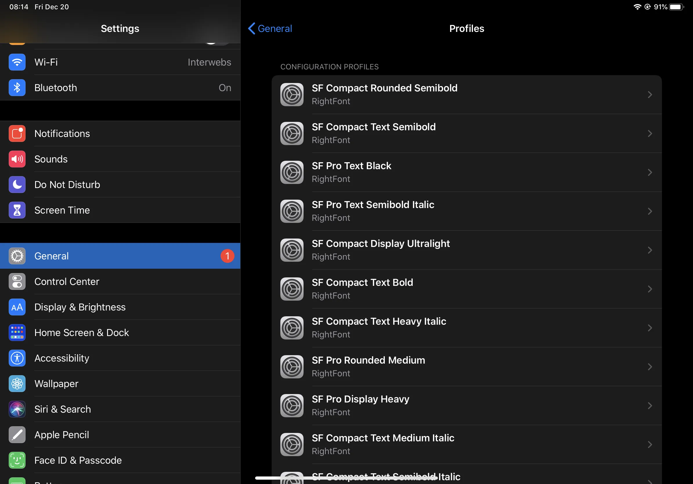
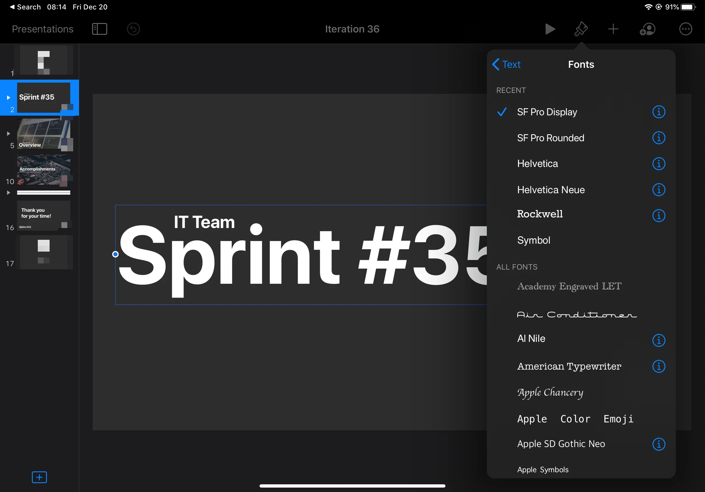

---
id: "5b06074d-efcb-4bd1-a6b5-b358f2a6530d"
date: "2019-12-20T11:10:00.000Z"
title: "Installing Custom Fonts on iOS"
summary: undefined
readTime: undefined
tagIds: ["c57e71dc-aada-4bde-b2cf-ce6ad0e1fb84","ffcd889d-91ab-49a0-9ff6-e7192fced192","d1307420-adb1-48ad-b57e-4944d56da9ea"]
tags: [{"id":"c57e71dc-aada-4bde-b2cf-ce6ad0e1fb84","name":"iPadOS","icon":""},{"id":"ffcd889d-91ab-49a0-9ff6-e7192fced192","name":"Blog","icon":"🌐"},{"id":"d1307420-adb1-48ad-b57e-4944d56da9ea","name":"Tutorial","icon":""}]
--- 
 
I had to install using a certificate. I installed using [Right Font](https://rightfontapp.com/v4.html). It was a very boring job since I had to manually install a profile in order for each font to work. But it turns out it works great.

