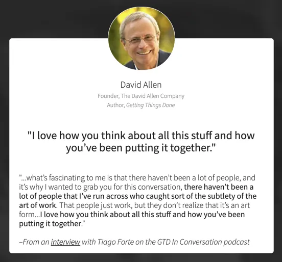
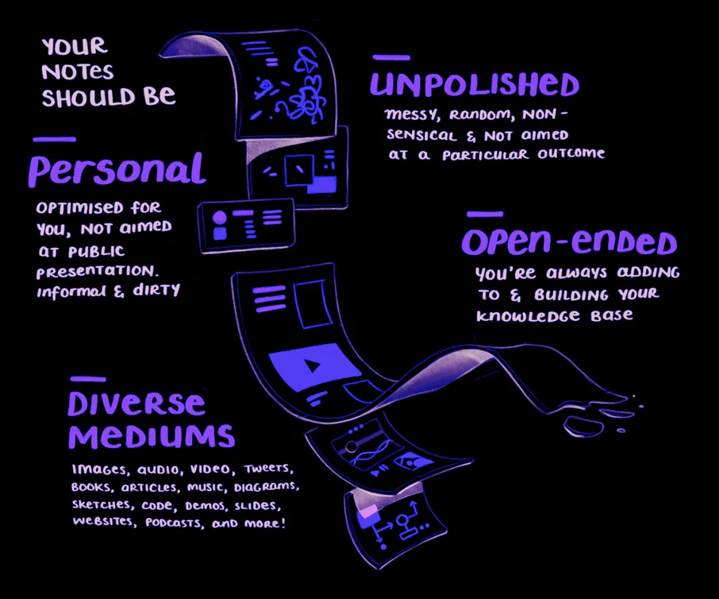

---
id: "a09fb5be-d001-43df-9ecd-868008211143"
date: "2019-10-10T18:21:00.000Z"
title: "PARA System"
summary: undefined
readTime: undefined
tagIds: ["6840a2fb-2165-4472-a666-4eb849e0d8f7","2508da40-1bdf-412e-83df-e1c6874ae7b1","ffcd889d-91ab-49a0-9ff6-e7192fced192"]
tags: [{"id":"6840a2fb-2165-4472-a666-4eb849e0d8f7","name":"Productivity","icon":"🗓"},{"id":"2508da40-1bdf-412e-83df-e1c6874ae7b1","name":"PARA","icon":"🧠"},{"id":"ffcd889d-91ab-49a0-9ff6-e7192fced192","name":"Blog","icon":"🌐"}]
--- 
 
I've been very resistent to the [PARA](https://www.notion.so/2508da401bdf412e83dfe1c6874ae7b1)  system trend, I was able to bypass this until now. What changed? **John** from egghead just sent an email talking about using the  **PARA** system with **Notion.** So since everyone is talking about this, I feel like I should at least understand what's it's all about.

So the **PARA** system comes from a course called [**Building a Secound Brain**](https://twitter.com/fortelabs) from [**Thiago Forte**](https://twitter.com/fortelabs)**.**

The course seems amazing but it's U$499 but even the legendary David Allen, reviewed the course. So I've researched a little bit More about Tiago.

It seems that Tiago is a _Evernote_ and _Things 3_ user. I've watched a interview he made with Keep Productive.

Tiago's goal is to make tasks simple to manage. (That might be the reason he's not using Notion)

# Building a Second Brain

Organizing for insight.

## [PARA](https://www.notion.so/2508da401bdf412e83dfe1c6874ae7b1) 

**PARA** aims on being a flexible system for connecting long term efforts into motivating goals

- **Projects**
- **Areas**
- **Resources**
- **Archive**

It technically solves the flow between **Non-Actionable Information** and **Actionable Tasks.** 

## Projects

Usually projects are tasks with an **specific deadline or endpoint** much like OmniFocu's projects. Tiago's advice here is to **Duplicate** **your project lists across platforms.**

Using all the same labels, reduces the amount of context switching between tools.

Projects should be organized in **Priority Order** do they reflect your long term goals and values?

## Areas

A continuous area of commitment. Habits, routines, rituals all of those are a area of commitment. You can differ areas from projects by remembering that projects are a laser focused on a specific goal, while areas are things that you maintain.

Areas are different to projects because you maintain areas and you achieve projects. They require very different mindsets. Projects are time bounded while areas are continous.

## Mindsweep

All your possible projects

- **Combine** projects tied to same outcome
- **Delete** uninportant ones
- **Move** someday/maybe projects to the bottom
- **Add single events to the Calendar** and off your project list

## Weekly Review

Create a habit to **reconsider** and **rearange** **priorities.**

## Desired Outcome

Define the desired outcome of **all of your projects**. What you want and what **success** looks like **written in the present tense with a specific date using action verbs (finalize submit send post publish complete)** event if it's not done by then, the date becomes a checking point.

So in topics

- Present Tense
- Specific Date
- Use action verbs [finalize, submit, send, post, publish complete]

# Setting up a PARA System

Here are some tips that will help you setting up the **PARA** system on your own workspace.

## Wipe Everything

There's nothign wrong with wiping the slate clean! Save everything to an archive and you'll find things if and when you actually need them. Also, remember to **Do it every year** in order to keep things tidy.  

## Folder Structure

Create a folder structure to start your workspace, create one folder for each of the following

- Project
- Areas
- Resources
- Archives

Try to mirror this structure across all apps and systems.

Dump all you unorganised files to _Archive_ with something that assign's today's date into it. (You can move them back over time)

Create folders for all your current projects.

## Planning Projects

When planning your projects is very important to **add hard constraints around time lines.** Anchor to other work/life events. 

Create tiny briefs that just outline 

- Who
- What
- When
- Why

**Timeline collaborators motivation!**

**Create a Metaplan**

Creatting a metaplan with your desired outcomes, and be very specific with these!

**Expand Outcomes**

Expand each outcomes into the projects needed to achieve it.

**Define Small Projects**

Break up big undertakings into little, manageble projects that you can systematically work through. It helps you from **overwhelm** and **procastination**

### Organization

- Arrange you projects in a logical sequence
- What needs to come first?
- Look for dependencies upon one another?

### Divide Into Chunks of Time

Divide you project help keep you in flow and pick up where you left off when you sit down to work. 

### Metaplans

Create metaplans for each smaller project. Collect all sources notes and Resources in one spot anything relevant, websites, notes, files, folders, examples literally everything!

Using digital notetaking apps to improve creative output (Notion, Evernote, Notes, any app will do) This is about building a personal knowledge base.

- Compile many types of media
- Promote Unusual Associations
- Incubate ideas over time
- Create visual artefacts (See things to understand them gives us spacial reasoning and pattern matching)
- Raw material for unique interpretations and perspectives (Forming opinions backed by research and intentional thoughts)

# Your Notes Should be

### Personal

Optimised for you, not aimed at public presentation. **Informal, direct** and **dirty**

### Unpolished

Messy, random, non-sensical and not aimed at a particular outcome

### Open-Ended

You're allways adding to and building your knowledge base

### Diverse Mediums

Images, audio, video, tweets, books, articles, music, diagrams, sketches, code, demos, sliders, websites, podcasts and much more!

## Consuming Information

We need to flip our approach to consuming information! Instead of fleeting moments of insight, we should make **Investments in a long future of learning and creation.**

Browsing the library of your own mind is enourmously different to the generalised documents of strangers.

## Consider 12 Favourite Problems

Consider 12 favourite problems you want to guide you over the next few years. These are your open-ended guides for learning.

Long term "slow bum" ideas; the big themes of your mind

# Progressive Summarisation

We need a note-taking system that balances with **Discoverability** and **Understanding**.

## Discoverability

Requires Compression to make notes smaller simpler, and easier to digest.

- Bolding Highlighting and writting summaries.
- Have to be able to quickly scan and find stored information

## Understanding

Keeping context in tact so the content is still meaningful and usefull. **Citations details** and **Examples**.

> 💡 How do I make what I'm consuming now useful to my future self?

As humans, It's very hard to predict what the future want's and needs

We solve that with **Progressive Summarization** condensing your notes in **stages**

## Notes First Organization

Engages you with the note content directly. Notes become single atoms we can rearrange in any form.

**Tags** are too **fragile** and require **constant maintainance**.

**Notebooks** are better but supress random connections and serendipity

## Notes Layers

Move notes though the layers opportunistically, only when you're organically reviewing them in daily work. Not every notes goes through all the layers.

1. **Raw Notes**
2. **Bold Passages**
3. **Highlights**
4. **Essential Summary**
5. **Remix into Original Creation**

Each layer adds a level of compreension and condenses its meaning. It gives us a personal information landscape we can easily navigate and drop down into for deeper context.

Focus on what resonates when highlighting and summarising. Don't worry about how it fits into the bigger picture. 

Gives us a personal information landscape that we can easily navigate and drop down into for deeper context.

# Maximizing Return on Attention

Thinkign of return on attention like **ROI.** 

We invest **attention** in tasks and want to make sure we see valuable **returns** for that effort

We ant to build a system for Personal Knowledge Management that frees up attention, rather than consuming it.

## The Flow

Energized focus, full involvement and enjoyment like a child immersed in play.

Valuable returns comes from the state of **Flow pinnacle** of **experience, performance learning**

## The Biochemistry of Flow

### Endorphins

Create pleasure and inner calm

### Nitric Oxide

Supress stress and creates relaxation

### Dopamine

Improves pattern recognition

### Anandamine

Improves divergent lateral thinking

### Norepinephrine

Creates focus to ignore distractions

## Sitting down to work

When we sit down to work we have to get through the struggle of

**Environmental Preparation** set up desk lighting, silence distractions

**Mental** **Preparation** recall relevant topics question facts priorities

**Emmotional Preparation** facing self-doubt, fear and uncertainty

All of that before we get into a state of flow. The good news is that the enourmous effor and attention cost of getting into flow makes us resistant.

## Placeholding

We can try to solve that will placeholding. Our focused work sessions need to be broken down into a series of small packets. **More frequent, shorter work** sessions, **less vulnerable to interruption.** 

- Research
- Brainstorms
- Outlines
- Drafts
- Final Edits

The breaks between packets allow you to gather feedback. Flexibility to create value in various time spans and contexts. It also allows us to **reuse packets** becomes a modular system between projects.

We need **clear goals** with **instant feedback** and a **good balance of challenge and skills** to enter in the flow.

Being good at jumping into small packets of work anytime requires us to master  **how we enter information in our system** and **how we take it back out to apply** in our problem.

## Don't Just Consume Content

Draw sketchnotes, make notecards, highlight, find meaningful ways to **interact** with it. This integrates what you're learning with what you already know and **encodes** the knowledge.

## Ways of Wrestling with Knowledge

### See

See it in different context get other opinions.

### Write

Take notes, write summaries

### Draw

Sketchnotes, mindmap and diagrams

### Produce

Create original content condesing, interpreting, critiquing, transforming

### Perform

Present at meetups record videos

### Sell

Any exchange of value, collaboration, teach others

